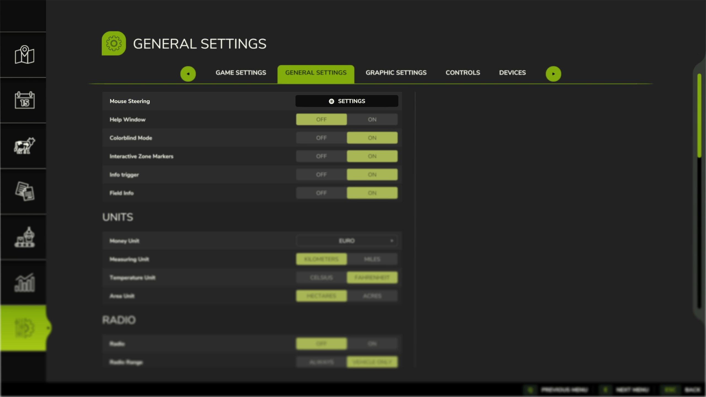
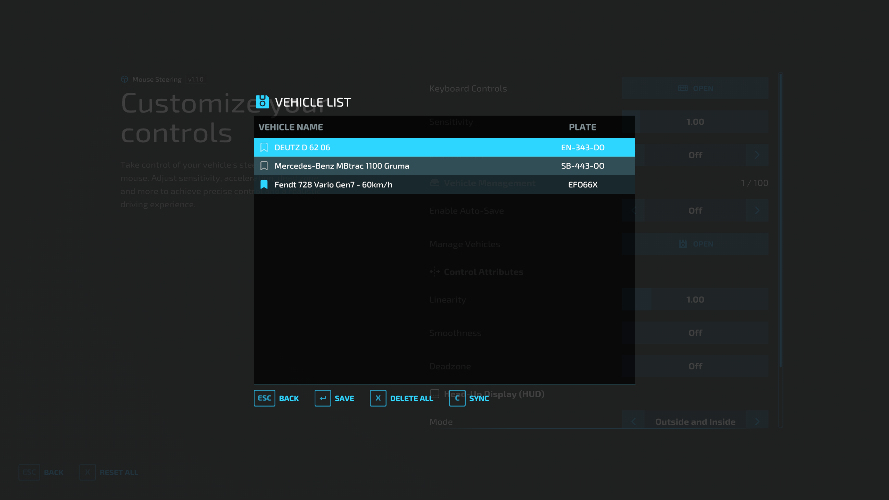
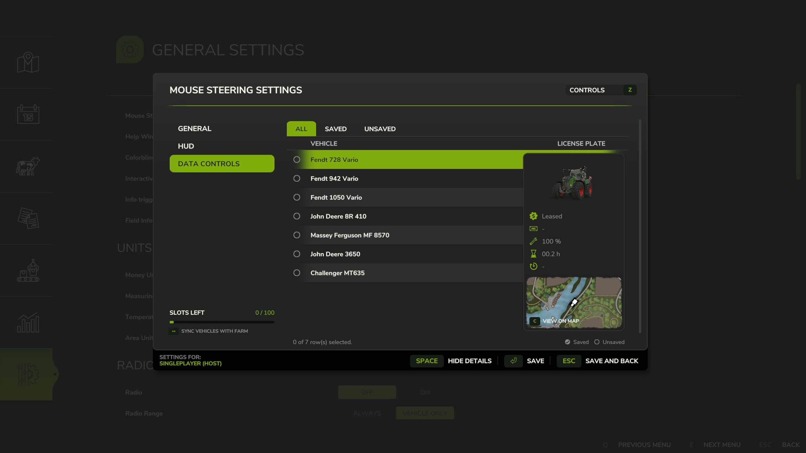

> **ℹ️ Info** This modification is exclusively distributed through **GitHub** and **ModHub** only - avoid link sharing sites that earn ad revenue from my work without permission.

   
  <b>Mouse Steering</b> enables mouse-based control of vehicle steering &mdash;
   
  with fully configurable sensitivity, linearity, dead zone, smoothness, and more.
   
   

## Installation

1. Download the latest version of the mod from the [Releases](https://github.com/modnext/mouseSteering/releases/) page or the official [ModHub](https://www.farming-simulator.com/mod.php?mod_id=334353&title=fs2025).
2. Copy the downloaded `.zip` file to your Farming Simulator mods folder:
   - Windows: `Documents\My Games\FarmingSimulator2025\mods\`
   - macOS: `~/Library/Application Support/FarmingSimulator2025/mods/`
   - Linux: `~/FarmingSimulator2025/mods/`
3. Start Farming Simulator 2025 and enable the mod in the Mods menu.

## Keybindings

| Key        | Action              |
| ---------- | ------------------- |
| `Ctrl + .` | Steering Control    |
| `Ctrl + /` | Save/Remove Vehicle |
| `Alt`      | Rotate Camera       |

**Note:** You can customize these keybindings in the game's Options menu under the "Mouse Steering" section.

## Screenshots

## License

Distributed under the GPL-3.0 license. See [LICENSE](https://github.com/modnext/mouseSteering/blob/main/LICENSE) for more information.
