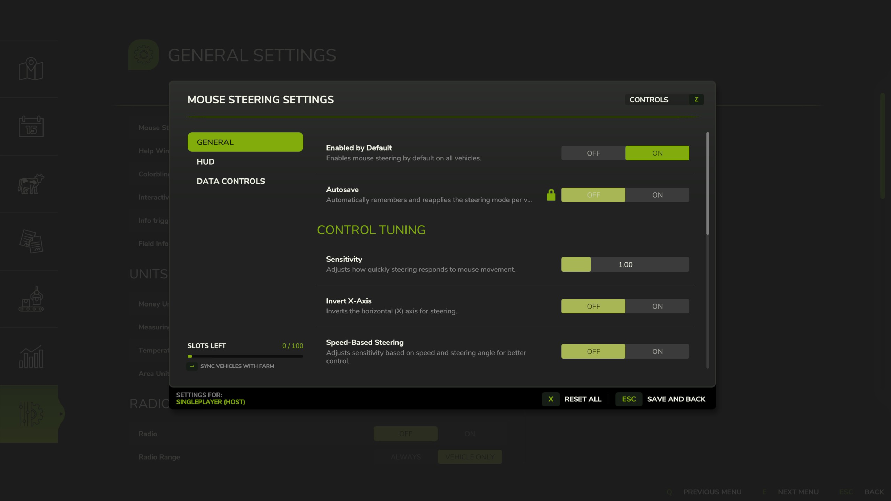

   
  <b>Mouse Steering</b> is a mod for precise vehicle control using your mouse &mdash;
   
  experience realistic steering and enhanced control for a more immersive ride.
   
   

## Installation

1. Download the latest version of the mod from the [Releases](https://github.com/modnext/mouseSteering/releases/) page or the official [ModHub](https://www.farming-simulator.com/mod.php?mod_id=299700&title=fs2022).
2. Copy the downloaded `.zip` file to your Farming Simulator mods folder:
   - Windows: `Documents\My Games\FarmingSimulator2022\mods\`
   - macOS: `~/Library/Application Support/FarmingSimulator2022/mods/`
   - Linux: `~/FarmingSimulator2022/mods/`
3. Start Farming Simulator 2022 and enable the mod in the mod selection menu.

## Keybindings

| Key          | Action                  |
| ------------ | ----------------------- |
| `Ctrl /`     | Open Steering Menu      |
| `Ctrl Space` | Enable/Disable Steering |
| `Ctrl .`     | Save or Remove Vehicle  |
| `Alt`        | Pause Steering          |

**Note:** You can customize these keybindings in the game's Options menu under the "Mouse Steering" section.

## Screenshots

## License

Distributed under the GPL-3.0 license. See [LICENSE](https://github.com/modnext/mouseSteering/blob/main/LICENSE) for more information.
